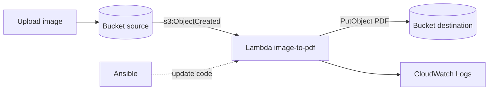

# Projet IaC — Image → PDF sur AWS

**Ynov Bordeaux · Programmation pour le Cloud · Terraform · Ansible · AWS**

Infrastructure provisionnée avec Terraform (modules réutilisables) : deux buckets
S3 et une fonction Lambda. Quand une image est déposée dans le bucket source, une
notification S3 déclenche la Lambda, qui **convertit l'image en PDF**, la **renomme**
et la dépose dans le bucket de destination. Ansible sert à **mettre à jour le code
source** du handler. Un pipeline GitHub Actions assure le contrôle qualité et sécurité.

---

## Architecture



Toutes les ressources portent obligatoirement le tag `Project = ynov-iac-2025`,
appliqué automatiquement via `default_tags` du provider AWS.

---

## Arborescence

```
ynov-iac-2025/
├── build.sh                     # construit le package pour le Lambda
├── lambda/
│   ├── handler.py               # code applicatif (conversion de divers fichiers en -> PDF)
│   └── requirements.txt
├── terraform/
│   ├── providers.tf             # provider AWS + assume-role + default_tags
│   ├── versions.tf
│   ├── variables.tf
│   ├── main.tf                  # modules + notification S3
│   ├── outputs.tf
│   ├── terraform.tfvars.example
│   └── modules/
│       ├── s3/                  # création de 2 buckets
│       └── lambda/              # fonction + IAM + logs
├── ansible/
│   ├── update_lambda.yml        # packaging du code python => depôt du package dans le lambda
│   ├── requirements.yml
│   ├── ansible.cfg
│   └── inventory.ini
└── .github/workflows/
    └── terraform.yaml
```

---

## Prérequis

- Terraform ≥ 1.6, AWS CLI v2, Python 3.11, Ansible
- Les identifiants de connexion

```bash
export AWS_ACCESS_KEY_ID="AKIA..."
export AWS_SECRET_ACCESS_KEY="..."
```

Le provider assume ensuite le rôle IAM restreint (`assume_role_arn`). Ce rôle doit
autoriser la création des ressources S3, Lambda, IAM (rôle/policy) et CloudWatch
Logs — toujours avec le tag `Project = ynov-iac-2025`.

---

## Déploiement

> ⚠️ **Important** : le package Lambda doit être construit **avant** `terraform plan`,
> car Terraform lit le zip au moment du plan.

```bash
# 1. Construire le package
./build.sh

# 2. Configurer les variables
cd terraform
cat terraform.tfvars   # fichier a éditer si besoin

# 3. Déployer
terraform init
terraform fmt -check -recursive
terraform validate
terraform plan
terraform apply
```

---

## Mise à jour du handler avec Ansible

Après modification de `lambda/handler.py` :

```bash
cd ansible
ansible-galaxy collection install -r requirements.yml
ansible-playbook update_lambda.yml \
  -e lambda_exec_role="arn:aws:iam::738563260931:role/ynov-image-to-pdf-role" \
  -e assume_role_arn="arn:aws:iam::738563260931:role/role_etudiants"
```

Le playbook reconstruit le package, assume le rôle IAM puis pousse le nouveau code (sous forme d'archive) via `amazon.aws.lambda`.

---

## Preuves d'exécution (AWS CLI)

```bash
# Récupérer les noms de buckets depuis les outputs
SRC=$(tofu -chdir=terraform output -raw source_bucket)
DST=$(tofu -chdir=terraform output -raw destination_bucket)

# 1. Uploader une image de test dans le bucket source
aws s3 cp ./exemple.jpg "s3://$SRC/exemple.jpg"

# 2. Vérifier que le PDF a été généré dans le bucket destination
aws s3 ls "s3://$DST/"

# 3. Télécharger le PDF produit
aws s3 cp "s3://$DST/XXXXXXX.pdf" ./resultat.pdf

# 4. Consulter les logs de la Lambda
aws logs tail /aws/lambda/ynov-image-to-pdf --follow
```

---

## Pipeline CI/CD

Le workflow `terraform.yaml` exécute :

| Étape | Rôle |
|-------|------|
| `terraform fmt` | vérifie le formatage |
| `terraform validate` | valide la syntaxe/config |
| `terraform plan` | prévisualise les changements |
| **Checkov** | analyse de sécurité IaC |
| **Infracost** | estimation des coûts |
| **ansible-lint** | qualité des playbooks |

Secrets/variables à définir dans le dépôt GitHub :
`AWS_ACCESS_KEY_ID`, `AWS_SECRET_ACCESS_KEY`, `ASSUME_ROLE_ARN`,
`INFRACOST_API_KEY` (secrets) et `SOURCE_BUCKET_NAME`, `DESTINATION_BUCKET_NAME`
(variables).

---

## Nettoyage

```bash
cd terraform
terraform destroy
```

> Astuce : si un bucket contient des objets, videz-le d'abord
> (`aws s3 rm s3://<bucket> --recursive`) car un bucket non vide bloque la
> suppression.
